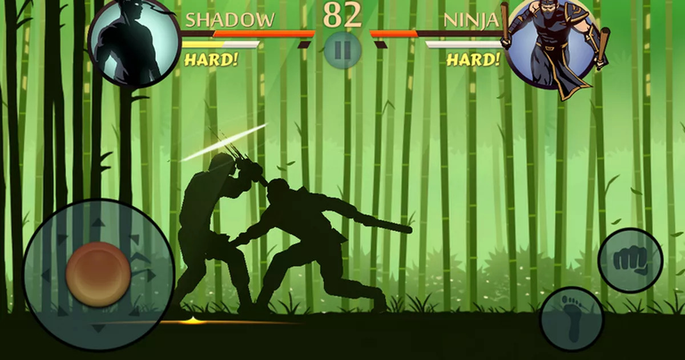
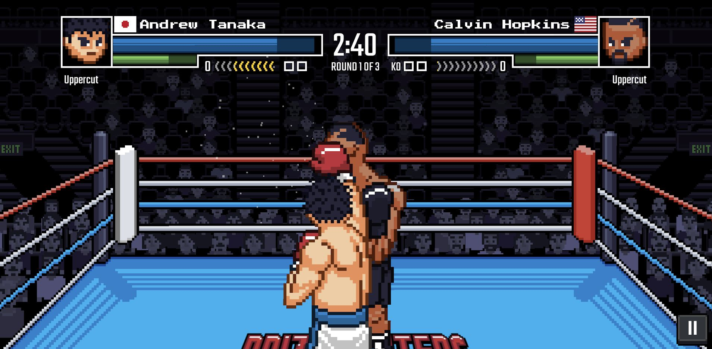

This is where my report will go temporarily, until I move it into a Word document. For now, I'll use a markdown file so that I can keep track of it with version control.

# Analysis

## Description

I will be developing an endless running and fighting game for Android. Essentially, the player will be jumping and moving between platforms (a 2D side view like in Super Mario Bros) and tackling various enemies. The game will use gesture controls (i.e. tapping and swiping the screen); I think this will create a tactile and satisfying experience for the player. The objective is to make it as far as possible before losing all your health points.

TODO improve following:

My initial idea was to have the player's movement fully automatic, controlled by an intelligent algorithm, however now I think that moving around is part of the fun and the strategy. I will still have to write that intelligent algorithm to control the movement of the enemies. I'm not yet sure exactly how the movement controls will work – perhaps they could be semi-automatic, meaning the character carries on moving by itself with the player swiping with their left thumb to change direction; or I could use a more traditional virtual on-screen joystick. I'll decide by testing prototypes.

It will be targeted at teenagers to young adults, because that is the age group which plays the most live-action computer games.

## Research

### Shadow Fight 2

Shadow Fight 2 is a mobile game in which the player combats artificial opponents in a 1 versus 1 battle. The strategy lies in timing your moves so that you hit your opponent when they are most vulnerable, for example when they are in the middle of throwing a kick themselves. You also have to learn the correct distance from your opponent from which to attack; otherwise your attacks miss. For instance, a kick must be done at a greater distance than a punch. I can incorporate similar behaviour in my own game.

There is much to learn here that I can apply to my project. One is that I should exaggerate the length of time it takes to perform these attacks, to give the opponent (whether it's the player, or the AI) time to be able to intercept it. If the attacks are too fast, there is no time to react. However, I could include enemies that have slightly faster attacks and are therefore more difficult to face.

One thing I didn't like about this game is that as far as I can tell, although different opponents look different and use different weapons, they behave in largely the same way. This made the game repetitive as it felt like I was doing the same thing over and over. In my game, I will make sure that the different enemies behave significantly differently. Furthermore, in Shadow Fight, the battles always took place in a flat, featureless area and were always 1-on-1, which contributed to this monotonous feeling. In my game, there will be different platforms and multiple enemies coming from different directions, so no two fights will be the same.

Finally, one more thing the game does well is how it seamlessly transitions from move to move. From what I can see, the game does this by always bringing the player back to the same rest position after each move. That way, for each move, you just have to animate it being performed from rest, to the move, and then back to rest. This saves on having extra animations for going directly from each move to each other move. Moreover, if you press the buttons to perform another move when your character is just about to finish a move, it will wait until the current move finishes and then perform the new move. But this only applies to near the end of a move: if you attempt to do another move immediately after *starting* a move, your input will get ignored. To decide how I want this to work in my game, I will write some different prototypes, so TODO END-USER and I can decide which one feels the best.

### Prizefighters 2

Prizefighters 2 is also a mobile game. In this game, the player has a 1v1 boxing fight against a computer-controlled opponent. The game essentially has two parts: the career aspect, where you manage your boxer's career and see him or her progress; and the actual fighting aspect, i.e. learning how to combat different opponents and exploit their weaknesses. I do not plan to have a similar career aspect to my game, so I will focus on the fighting instead.

As you can see from the image, the perspective is pseudo-3D, with the player's character appearing in front of the computer-controlled opponent. However, it still uses 2-dimensional assets, and the camera's perspective is fixed. This is in contrast to Shadow Fight 2, where the characters appear side by side. As my game is an endless runner, the character will be moving through a world, and to show that the character is moving I would have to have a backdrop moving past the character. TODO prototype?

### Game Programming Patterns

### Designing Games

## End User

TODO decide end user -- someone who has played fighting games before, knows about them, is good at them and has an interest in a new one. Do an interview/questionnaire

## Prototyping

TODO prototypes on controls and whether I should queue a move if it is inputted while another move is taking place (see final paragraph of Shadow Fight 2 research)

## Modelling

## Objectives

## Critical Path

# Documented Design

## Game Events

## Entity-component-system Pattern

## TODO what other sections should I have?

# Technical Solution

# Testing

# Evaluation

# Appendix

# References

