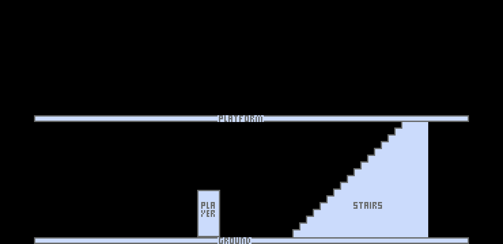

This is where my report will go temporarily, until I move it into a Word document. For now, I'll use a markdown file so that I can keep track of it with version control.

TODO add images to the whole thing

# Analysis

## Description

### Gameplay

I will be developing an endless running and fighting game that will run on Android, Windows and Linux. Essentially, the player will be running and jumping between the ground and a raised platform and tackling various enemies. It will be 2D from a side camera perspective (like in most platformer games such as Super Mario Bros; see the images in the Prototyping section). But unlike Super Mario Bros, there won't be an end point. The objective is to make it as far as possible before losing all your health points.

TODO SMB image on the side

There will be various different types of enemy, each with noticeably different behaviour. For example, there could be one type which has lots of health and tries to block your path, and there could be another type which attacks in large groups, and they coordinate to surround you.

As for how the combat will work, it will be mostly melee. This is because I can't see how I can make ranged combat fun – there isn't much variety in shooting from afar. On the other hand, there can be lots of variety in melee combat: high punches, low punches, spinning punches, uppercuts, low kicks, front kicks, high kicks, turning kicks and jumping kicks. My idea is to have all of these different moves available to the player, and each has their advantages and disadvantages.

Another important aspect of the gameplay will be moving between the two levels (the ground level and the raised platform), to stay in a location that makes it easier to combat. For instance, the player may want to stay on the upper level as much as possible, so that they can eliminate enemies easily by jumping down and performing a drop-kick. But if enemies come at you from the upper level, you may want to go down to the lower level so that you can run past them.

There will be several methods of switching between the 2 levels. First, there will be the self-explanatory staircases and ladders, which appear from time to time, and offer an easy way to go up or down. But you should also be able to jump up on top of a table on the ground level and jump up, grabbing hold of the banister and climbing over it onto the first floor. Furthermore, if you are on the upper level and wish to descend, you should be able to climb over the banister, and drop to the floor, and roll. If you fail to time the roll correctly, you will receive fall damage. These last two methods will be difficult to pull off (especially to pull off quickly), so they will be an alternative method aimed at experienced players, and are intended to add more variety to the game.

Above is my initial description of the game. Since writing the rest of the analysis, I have decided to add some features and I've decided in more detail how the game will work. The description above is still correct, it's just missing those extra features. See my objectives for a more comprehensive description of my game.

### Controls

My initial idea was to have the player's movement fully automatic, controlled by an intelligent algorithm, however now I think that moving around is part of the fun and the strategy. I will still have to write that intelligent algorithm to control the movement of the enemies.

On Android, the game will use gesture controls (i.e. tapping and swiping different areas of the screen); I think this will create a tactile and satisfying experience for the player. I'm not entirely decided on what the controls will be yet, but perhaps the best approach would be that the left thumb is used for moving around (using 4 virtual, on-screen buttons), and the right thumb is used for attacking/blocking. Then, you could punch by swiping the right-hand side of the screen with your right thumb. Maybe you could swipe diagonally upwards for a high punch, or directionally downwards for a low punch.

Of course, on Windows and Linux, the controls will have to be different. My initial idea is that the left hand will control movement using the W, A, S and D keys. The A and D keys could be used to run left or right respectively, the S key to roll or go down to the ground level, and the W key to jump or go up to the platform. The right hand will be used for attacking. Maybe it could simply be using the mouse to perform the same gestures as on Android. In other words, to punch you would click and drag the cursor to the right. 

One concern I have with these controls is that they require more work from the user. Usually in a mobile fighting game, all the user has to do to punch or kick is tap a button. I want to try something new for my game as I think it would be more satisfying to attack using a combination of different swipes than simply pressing buttons, but I might be wrong – it might be too difficult to learn. I will decide what the actual controls will be through prototyping and testing to see if it feels natural and is comfortable for the user.

### Theme

The protagonist of the game (the character that the user controls) will be a woman called Jane Pond. She is a spy who was working undercover in a foreign intelligence headquarters, but she got found out, so she has to run for her life. However, she wasn't carrying a weapon (so that she didn't attract attention), so she must fend for herself empty-handed.

## End User

The game will be targeted at teenagers to young adults, because that is the age group which plays the most live-action computer games. My third party will be Rudy Moran, a year 13 sixth form student.

Rudy has experience playing PC and Android games, so his opinion is valuable help. I did prepare some questions for him, but the conversation diverged, and the result was more useful than the questions anyway.

There are many features that were mentioned in the conversation that I could add to my game, however I must be careful not to add too many features because that would make it too hard to code and maintain. I have outlined beside each of my notes my thoughts on it, and the extent to which I will implement it in my game.

Below are my notes for the conversation.

***What do you think makes a good endless running game?***

- High score definitely
  - Was already going to do this
- Should change each time you play it
  - Will be randomised, and I will implement a leveling up system
- Needs some level of randomisation
  - The layout and enemies will be randomised
- Pickups and items
  - I will implement a small number of items

***Can you give some examples of items or power-ups that I can include in my game?***

- Health pickup, like bandages
	- I will implement bandages
- Different weapons that you can pick up
  - I will implement a pistol but that will likely be the only weapon, and Jane will start out with it

***What important thing do many games get wrong?***

- Become stale quickly
	- I will implement leveling up, and the layout will be randomised so no two runs will be the same
- If there's no progress, you're going to get bored quickly
	- You will be able to level up, which should create a sense of progress
- Needs a highscore or leveling up
	- See above
- Leveling up means permanently improving the player's abilities (e.g. more health) using XP earned by getting far
  - This is how leveling up will work in my game

**Other ideas that came up in the conversation**

- Swipe with knife for area of effect damage
	- I will not implement a knife as that would make punching and kicking useless
- Buttons to change between weapons you have picked up
	- Instead of another button, the user will be able to draw a circle with their right thumb to switch between using fists and using the pistol
- There could be a pistol but with limited ammunition, which could be picked up as a rare item
  - I will do this, and the pistol's ammo capacity can be another ability that you can level up
	
I also asked Rudy for his opinion on using touch gestures on Android rather than virtual buttons, which most mobile games use. He liked the idea.

## Research

### Shadow Fight 2


Shadow Fight 2[3] is a mobile game in which the player combats artificial opponents in a 1 versus 1 battle. The strategy lies in timing your moves so that you hit your opponent when they are most vulnerable, for example when they are in the middle of throwing a kick themselves. You also have to learn the correct distance from your opponent from which to attack; otherwise your attacks miss. For instance, a kick must be done at a greater distance than a punch. I can incorporate similar behaviour in my own game.

There is much to learn here that I can apply to my project. One is that I should exaggerate the length of time it takes to perform these attacks, to give the opponent (whether it's the player, or the AI) time to be able to intercept it. If the attacks are too fast, there is no time to react. However, I could include enemies that have slightly faster attacks and are therefore more difficult to face.

One thing I didn't like about this game is that as far as I can tell, although different opponents look different and use different weapons, they behave in largely the same way. This made the game repetitive as it felt like I was doing the same thing over and over. In my game, I will make sure that the different enemies behave significantly differently. Furthermore, in Shadow Fight, the battles always took place in a flat, featureless area and were always 1-on-1, which contributed to this monotonous feeling. In my game, there will be different platforms and multiple enemies coming from different directions, so no two fights will be the same.

Finally, one more thing the game does well is how it seamlessly transitions from move to move. From what I can see, the game does this by always bringing the player back to the same rest position after each move. That way, for each move, you just have to animate it being performed from rest, to the move, and then back to rest. This saves on having extra animations for going directly from each move to each other move. Moreover, if you press the buttons to perform another move when your character is just about to finish a move, it will wait until the current move finishes and then perform the new move. But this only applies to near the end of a move: if you attempt to do another move immediately after *starting* a move, your input will get ignored. To decide how I want this to work in my game, I will write different prototypes for each method when I do my technical solution, so TODO END-USER and I can decide which one feels the best.

### Prizefighters 2


Prizefighters 2[4] is also a mobile game. In this game, the player has a 1v1 boxing fight against a computer-controlled opponent. The game essentially has two parts: the career aspect, where you manage your boxer's career and see him or her progress; and the actual fighting aspect, i.e. learning how to combat different opponents and exploit their weaknesses. I do not plan to have a similar career aspect to my game, so I will focus on the fighting instead.

As you can see from the image, the perspective is pseudo-3D, with the player's character appearing in front of the computer-controlled opponent. However, it still uses 2-dimensional assets, and the camera's perspective is fixed. This is in contrast to Shadow Fight 2, where the characters appear side by side. As my game is an endless runner, the character will be moving through a world, so to show that the character is moving I would have to have a backdrop moving past the character (like in Temple Run). This would mean 3D assets, which would add too much unnecessary complexity to my game. I want my game's technical complexity to be in other areas, such as the enemies' AI, therefore I will use a camera perspective similar to Shadow Fight and not Prizefighters.

TODO add Temple Run images beside text with caption "As the character moves, the user sees the building from a different angle"

After playing the game for around one hour, I found the gameplay fairly simple and repetitive. It seemed to consist of guarding yourself until your opponent stops throwing punches, then throwing some punches back. There is a gameplay feature that aims to make it more interesting: "special punches". The in-game tutorial attempts to explain how they work, but when I tried to use them, they didn't seem to deal much damage, and I was better off just focusing on the easy but boring blocking and punching. 

I was concerned I might give Prizefighters an unfair analysis due to not spending much time learning how to play it; I had played Shadow Fight for 2 years for my own enjoyment. For this reason, I did some extra research by reading an article by Tim at levelwinner.com[1]. This did give me useful tips, such as "You can also stun your opponent by landing a punch right before they launch one." However, I feel that a game should be fun before you've mastered it; you shouldn't have to do research or spend many hours to enjoy the game. I will try to make my game adhere to Bushnell's law of game design[2], "easy to learn and difficult to master", although this is very difficult, so I may not be able to accomplish it.

### Game Programming Patterns


TODO add code examples to help explain the service locator pattern

Game Programming Patterns[5] by Robert Nystrom is a book that describes the benefits and drawbacks of various programming patterns that can be used in games. The code examples used in the book are in C++, but as Nystrom states, "that isn’t to imply that these patterns are only useful in that language"[7]. The actual patterns are language-agnostic. Here I will discuss some tips and patterns I got from this book.

The first tip is that "the measure of a design is how easily it accommodates changes"[6]. Making sure the code is easy to change is the whole point of good architecture. He elaborates, saying that the first step of adding a new feature is to learn the existing code that you are working with, and that that is often the most time-consuming part. He recommends decoupling the code, which means that a new programmer would only have to learn about the specific section of the program they are working on.

Nystrom also discusses the downsides of flexibility, one of which is performance. He says "performance is all about assumptions"[8] and making a system more flexible reduces the assumptions we can make. This is something I have struggled with in the past with making my own games; I am sometimes uncertain whether to make my program open to big changes or to limit it, so I can make it faster. I think that for my NEA project, performance will not be of much concern, as my game won't be particularly complex or CPU-intensive. So I will focus on making my game loosely coupled and easy to be changed.

Of the patterns, the one I found most applicable to my game was the Service Locator pattern. In this pattern, code that performs a task that may be required by various parts of the game (for example, playing audio) is called a *service*. Each service has an interface without any implementation, and one or more *service providers*, which actually perform the task. Before the service needs to be used, external code registers one of the service providers with a service locator. Then, when you want to use the service, you call a method in the service locator, which returns the service provider that was registered. 

The reason I believe this would be very helpful for my game is that I could have separate service providers for Android and PC, if I need to. While libGDX allows me to play audio on Android and PC using the same API, I will need two different controls systems because PC will use the keyboard whereas Android will use touch gestures. If I used the service locator pattern I could just register the service providers in the small, platform-specific module and then the service locator would take care of the rest. I could also have additional service providers that aid in debugging the code, such as a NullAudioService (which implements AbstractAudioService but doesn't do anything), or a LoggedAudioService (which behaves the same as AudioService but also logs a message).

TODO consider that systems from ECS are already similar to service locators in that they can be easily swapped out for another system. I might end up using some sort of hybrid where I have an abstract PlayerInputSystem and an implementation for each of Android and PC. Then I add the correct system to the engine in the platform-specific code

### Libraries I Will Use

TODO add pictures

TODO maybe discuss TODO about system/service hybrid

To develop my game I will use libGDX[9], which is a cross-platform Java game development framework. It provides the basics for what I need in my game (such as audio, graphics, user input and maths APIs), while still being flexible – it doesn't tie you into a specific approach, like Unity does. Also, there are other frameworks that are made by the libGDX project but are optional extensions. One of these that I will use is Ashley, which is a tiny framework for the entity-component-system pattern. I will discuss ECS in the *Modelling* section.

However, the language I will be using is Kotlin[10], not Java, primarily because I am more proficient at it. In addition, its main benefits over Java are conciseness and null-safety. As it is completely interoperable with Java, I see no downsides to using it. In fact, there is already a library called libKTX[11] which adapts libGDX to better take advantage of Kotlin's benefits. I will also use libKTX in my project.

For any physics, I will likely use Box2D[12] as it works well with libGDX (they have created a Java/libGDX wrapper for it) and provides all that I need. I may not need much physics in my game, as it is mostly jumping on platforms, but using Box2D will give me the ability to add nearly anything I want to my game without worrying about its physics being too difficult for me. I want the other areas of my game to be the complex parts, code that is specific to my game and that there are no pre-existing libraries for.

Finally, I may also use Scene2D[13] for the user interface. Scene2D is a part of libGDX designed for managing text, buttons, menus and other UI elements. It expects you to provide any graphical assets in the form of its Skin class and JSON files that reference images. However, the libGDX tests provide some assets that anyone is allowed to use, so I will use them.

## Prototyping



Before I can even get started on the game, there is a lot of low-level coding that needs to take place, to set up all the libraries I am using and do all sorts of things that aren't directly related to the game. It didn't take too long though, as I could copy and adapt my code from my other libGDX project.

The project is divided into 3 modules: android, core and lwjgl3. android contains code specific to the Android version; lwjgl3 is code for the Windows/Linux version (libGDX uses a library called LWJGL behind the scenes); and core is for all other code that isn't specific to a platform. Core will be the largest module by far as it will contain pretty much the whole game. android and lwjgl3 will contain just the launcher code.

Now I will briefly explain how my prototype works, on a high level, using the most important core code. See Documented Design/Entity-component-system Pattern for a detailed explanation of entities, components and systems.

```kotlin
// add entities

val player = engine.entity {
	with<TransformComponent> {
		setSizeFromTexture(textures.prototype_player)
		rect.setPosition(120f, 5f)
	}
	with<GraphicsComponent> {
		sprite.setRegion(textures.prototype_player)
	}
	with<PlayerComponent> {}
}

engine.entity {
	with<TransformComponent> {
		setSizeFromTexture(textures.prototype_ground)
		rect.setPosition(0f, 0f)
	}
	with<GraphicsComponent> {
		sprite.setRegion(textures.prototype_ground)
	}
}

engine.entity {
	with<TransformComponent> {
		setSizeFromTexture(textures.prototype_platform)
		rect.setPosition(0f, 90f)
	}
	with<GraphicsComponent> {
		sprite.setRegion(textures.prototype_platform)
	}
}

engine.entity {
	with<TransformComponent> {
		setSizeFromTexture(textures.prototype_stairs)
		rect.setPosition(190f, 5f)
	}
	with<GraphicsComponent> {
		sprite.setRegion(textures.prototype_stairs)
	}
}

//add systems to engine
engine.run {
	addSystem(RenderSystem(batch, gameViewport))
}
```

First, I create my entities and add them to the engine. This occurs in GameScreen.show. For each entity I initialise the components that the entity will have. For example, the ground entity has a TransformComponent and a GraphicsComponent. I set the size of the TransformComponent to the dimensions of the ground sprite, and I set the position to the origin. Then I set the texture of the GraphicsComponent to the ground sprite.

```kotlin
override fun update(deltaTime: Float) {
	gameViewport.apply()
	batch.use(gameViewport.camera.combined) {
		super.update(deltaTime)
	}
}

override fun processEntity(entity: Entity, deltaTime: Float) {
	val transformComp = entity.getNotNull(TransformComponent.mapper)
	val graphicsComp = entity.getNotNull(GraphicsComponent.mapper)

	if (graphicsComp.sprite.texture == null) {
		log.error { "Entity $entity has no texture for rendering" }
		return
	}

	if (!graphicsComp.visible) return
	
	graphicsComp.sprite.setBounds(transformComp.rect)
	graphicsComp.sprite.rotation = transformComp.rotation
	graphicsComp.sprite.draw(batch)
}
```

Then, I add all the systems to the engine. My prototype only uses one system: the RenderSystem. This system iterates over all entities that have both a TransformComponent and a GraphicsComponent, and draws them onto the screen. I override the update method, which is called once per frame and would usually iterate over all the entities and call processEntity for each one with both a TransformComponent and a GraphicsComponent. I change it to first apply the gameViewport, which moves the camera so that any subsequent rendering is in world coordinates. Next I use the SpriteBatch, which means that all the render calls inside it are just drawing onto the batch, and then at the end of the block the batch will optimise them for processing my the GPU and then send them off.

In processEntity (this gets called once for each entity that should be rendered), I get the entity's TransformComponent and GraphicsComponent. I then ensure that the GraphicsComponent has a texture and that it is set to be visible. Finally, I set the bounds and rotation of the sprite as specified by TransformComponent, and I draw it.

## Modelling

### User Interface


When the user opens the app, they will see Jane Pond spying undercover on the left (an animated loop). On the right there is a large screen displaying the highscore and 4 buttons: "Play", "Abilities", "Settings" and "Credits".

If the user taps the "Settings" button, various settings will be displayed on the screen (e.g. SFX volume, music volume, show tutorial) along with a button to go back.

The "Credits" button will display the credits along with a button to go back.

If you press the "Abilities" button, the screen will display the amount of XP the user currently has, and the current level of each of Jane's abilities, each with a button to upgrade it. For example, there will be a max health ability. The screen will display the current max health, with a button to upgrade it. The button should display the cost of upgrading and the amount the max health would go up by should you press the button. There should also be a button to return to the main menu.

If you press the "Play" button, a siren will start, and a picture of Jane Pond will appear on the screen, along with the flashing words, "IMPOSTOR DETECTED". Jane will start running and this will transition smoothly into the game.

If the user hasn't completed the tutorial since installing the app, or the "show tutorial" option was enabled in the settings, the "Play" button will be replaced by a "Tutorial" button. When this is pressed, the game will start in tutorial mode. This means that it interactively shows you how to play the game. At the end of the tutorial, it transitions smoothly into the real game.

The game UI will consist of the score displayed in the top left, along with a pause button. When the pause button is pressed, the game logic and animation is suspended, and a popup appears stating that the game has been paused. This popup contains a button to resume the game.

Finally, when the user loses all of their health, a popup appears saying that you have died. It also states your final score and highscore and has a buttons to play again and to return to the main menu.

## Objectives

Since writing the rest of my analysis, my idea for the game has changed somewhat. This list of objectives is the most complete and up-to-date definition of what my game should be like. In addition, I have deliberately left out details on exactly how the controls for movement and combat will work, as this is likely to change many times and I will need to decide this through rapidly iterating between prototyping and testing and asking Rudy for his opinion.

### A-level Standard Objectives

TODO add sketches to better explain things

1. Main menu
	1. The "play" button should start the game
	2. The "settings" button should display the settings
	3. The "credits" button should display the credits
	4. In the main menu, to the right of Jane, there should be a display screen (i.e. in the intelligence headquarters, Jane is near a large screen. It is imagined that there are many of these screens throughout the building which are used to communicate messages to everyone)
	5. The buttons should be displayed on this screen
	6. The highscore should also be displayed on this screen
2. Settings
	1. There should be a setting to change SFX volume
	2. There should be a setting to change music volume
	3. There should be a button to return to the main menu
3. Credits
	1. All the credits should be displayed
	2. The user should be able to scroll (unless all the credits fit on the screen)
	3. There should be a button to return to the main menu
4. Game UI
	1. There should be the current score displayed at the top
	2. The current health should also be displayed
	3. There should be a pause button displayed
	4. Pressing the pause button pauses the game logic and animation
	5. Pressing the pause button displays a popup
	6. The popup indicates that the game is paused
	7. The popup includes a button to resume the game
	8. The popup includes a button to return to the main menu
	9. The resume button resumes game logic and animation and closes the popup
	10. The main menu button discards the user's progress in the game and returns to the main menu, without saving the score
5. Movement and physics
	1. Jane should be able to run left and right
	2. Jane should be able to jump
	3. Jane should be able to go up or down between the ground and upper level
	4. Jane should not be able to walk through enemies; they should block her path
6. Combat
	1. Jane should be able to punch enemies
	2. There should be at least 3 different types of punches
	3. Jane should be able to kick enemies
	4. There should be at least 3 different types of kicks
7. Enemies
	1. There should be at least 3 different types of enemy
	2. Each type of enemy should behave noticeably differently
	3. The enemies should be controlled by a rule-based AI
	4. The enemies should appear to behave intelligently
	5. Enemies should be able to deal damage to Jane, which decreases her health
8. Game logic
	1. The game should render a background behind Jane
	2. Staircases, ladders, objects that Jane can climb on top of, enemies and items should appear randomly
	3. Staircases, ladders, objects that Jane can climb on top of, enemies and items should not appear too close together or too far apart, making the game unfairly easy or hard
	4. The difficulty of the game should increase the further the player gets – this should be done by making tough enemies appear more often and making everything good for the player appear less often
	5. The score increases when Jane progresses to the right
	6. The score also increases when Jane eliminates enemies
9. Sound
	1. A music loop should be played in the main menu
	2. A different loop should be played in the game
	3. Sound effects should be played whenever it makes sense (e.g. the player or an enemy was hit)
10. Game over screen
	1. When the player runs out of health, a game over screen should be displayed
	2. The score should be displayed
	3. The highscore should be displayed
	4. There should be a button to play again
	5. There should be a button to return to the main menu
	6. If the user has beaten their highscore, this should be indicated
	7. The highscore should be saved so that it persists when the app is closed

### Extension Objectives

1. Extra-nice main menu screen
	1. Jane could be animated to appear to be spying undercover before she is found out (before the game starts)
	2. When the "play" button is pressed, there could be a short animation where a picture of Jane Pond will appear on the screen, along with the flashing words, "Impostor detected"
	3. Jane could then start running towards the right
	4. Then, the camera could zoom out and the game UI (i.e. the score and pause button) could appear (thereby seamlessly transitioning from the main menu to the game)
2. Abilities screen
	1. There could be a button in the main menu to open the abilities screen
	2. Could display the amount of XP the user currently has
	3. Could display the current level of each of Jane's abilities
	4. Each ability could have a button to upgrade it
	5. Could display the cost of upgrading each ability
	6. Could display the amount the ability level would go up by if the user were to press the button
	7. Pressing a button could increase the ability level by the amount specified and decrease the XP by the amount specified
	8. There could be a button to return to the main menu
	9. The level of each of Jane's abilities and the user's current XP level could persist when the app is closed
3. Tutorial
	1. There could be a tutorial that teaches you the controls for the game
	2. It could also teach you strategies on how to play the game well
	3. It could be interactive, i.e. it teaches you as you play the game
	4. There could be different levels of tutorial: a basic tutorial to get started, an intermediate tutorial, and an advanced tutorial
	5. There could be a button in the main menu that starts the tutorial
4. More movement options
	1. Jane could be able to roll
	2. Jane could be able to go up or down staircases
	3. Jane could be able to climb on top of large objects
	4. Jane could be able to jump from large objects to climb onto the upper level
	5. Jane could be able to drop from the upper level down to the ground level
	6. Jane could only be able to jump when she is on solid ground
	7. When Jane drops from a large height (e.g. from the upper level or from near the top of a ladder or staircase), if the user does not do a forward roll within 500 ms of touching the ground, Jane's health is decreased
5. Background objects
	1. There could be objects that appear randomly, such as a desk, a plant or a door
	2. Jane would not be able to interact with these objects; she would walk past them as it they weren't there
6. Items
	1. There could be at least 3 different types of item, including an ammunition item and a bandage item
	2. When Jane touches an item, the item's effect could be applied
	3. When touching the ammo item, Jane's pistol is filled back up to its maximum capacity
	4. The ammunition item could be rare enough so that the player is usually forced to use punch and kick rather than use the pistol
	5. When touching the bandage item, Jane's health is increased (but not past the maximum health)
	6. Jane could be able to shoot enemies with her pistol
	7. Jane could only be able to shoot when she has at least one round in her pistol
	8. There could be other weapons that Jane could pick up and use, such as a knife
7. Missions
	1. There could be various missions available to complete
	2. They could be displayed on groups of 3
	3. When the user completes all 3 missions, their level could increase and they could be presented with the next 3 missions
	4. The user's current level could be displayed on the main menu
	5. The 3 active missions could be displayed in the main menu
	6. The 3 active missions could be displayed for a few seconds after the user presses the "play" button
	7. The missions that are already completed could be highlighted to indicate that they're completed
8. Coins
	1. Coins could appear in the game
	2. The player could collect the coins when they run through them
	3. The current number of coins that the user has could be displayed in the shop (see below)
	4. The game over popup could display the number of coins gained in that run
9. Shop
	1. There could be another button in the main menu to open the shop screen
	2. In the shop screen, the player's current number of coins could be displayed
	3. The user could buy various different items using their coins
	4. Each item could cost a specific number of coins
	5. Some items could be consumable (meaning they are used up in the game and to use them again the user would have to buy them again)
	6. The user could be able to buy more than one of each consumable item
	7. Some items could be permanent (meaning they are not used up in the game and once purchased they can be used forever)
	8. The user shouldn't be able to buy more than one of each permanent item

## Execution

TODO discuss critical path, my approach to developing a solution, and where I'll get assets from

The critical path for my game (the crucial steps that are most important to get done) are:

1. Main menu with a "play" button
2. Score displayed at the top of the screen
3. Jane can run left and right
4. Score increases as Jane runs to the right
5. Enemies appear randomly
6. Jane can attack the enemies
7. The enemies can decrease Jane's health
8. When Jane's health reaches zero, the game is over
9. The game over popup displays the final score
10. The game over popup has a button to play again

# Documented Design

# Class Diagram

Below is a class diagram of the project. Directed associations () signify that the first class has a member variable of the second class's type. Generalisation associations () signify that the first class is a subclass of the second class.


## Entity-component-system Pattern

In my project I used the entity-component-system architectural pattern, which I believe to be a very good pattern for separating logic and data, increasing cohesion and reducing coupling. In addition, ECS is primarily composition-based rather than inheritance-based, which makes it more flexible and easier to maintain and adapt. The entities, components and systems make up the majority of the code. See the technical solution section table of contents for a brief description of every component and system. Below is a brief description of the pattern.

### Entities

- Just a bag of components
- Often initialises each component with specific values, e.g. a player entity might specify the coordinates of the transform component
- Examples are: the player, a specific enemy, a specific item, a specific flight of stairs, and perhaps also abstract things such as game state
- They can be hard-coded or generated dynamically
- In libGDX they are represented by an object
- You can add and remove them from the engine to remove them from the game, while their state is still saved in the object
- I initialise some entities from a screen's `show` method (e.g. player) and some entities dynamically from a system (e.g. the enemies)

### Components

- Only holds data related to a specific thing
- Because each entity can have any combination of components, ECS is a more flexible approach to reusing code than inheritance
- In libGDX they are represented by a class
- I put all my components in the `comp` package
- When I add components to an entity, libGDX tries to reuse component instances from deleted entities, or otherwise creates a new instance
- Whenever it reuses an old component, libGDX first calls the `reset` method to prepare the component to be used again
- Example components: `TransformComp` (specifies position and orientation of an entity), `GraphicsComp` (specifies texture and whether it should be rendered)

### Systems

- A system is a class that contains code for a specific part of the game logic
- Systems act on the data stored in different entities' components
- Separating game code into different systems increases cohesion and makes specific sections of code easier to find
- It makes it easier to turn on or off specific functionality
- For example `ActionSys`, `PlayerInputSys`, `RenderSys`
- Systems can also be added and removed from the engine at runtime to turn them on or off
- `IteratingSystem`s are a type of system that iterate over a group of entities that have specific components and perform some task for each entity
- For example, `RenderSys` is an `IteratingSystem` that iterates over all entities with a `TransformComp` and a `GraphicsComp` and renders each one onto the screen

## Launch

The project consists of three Gradle modules: android, core and lwjgl3. The vast majority of the code is platform-agnostic and is located in the core module, which leaves the platform-specific code in the android and lwjgl3 modules. There are two entry points for the app: AndroidLauncher and Lwjgl3Launcher, which launch the app on Android and PC respectively. The launcher classes both create ComboKing, which is the main class for the game. android and lwjgl3 both depend on core, but core does not depend on android or lwjgl3. This means that if I wanted to add support for a third platform (e.g. HTML5), in theory I wouldn't have to edit any of the existing modules. All I would have to do is create a new HTML5 module with a HTML5 launcher class. 

My main class takes a single argument as a parameter, which is a function that takes a GameEventManager (and the screen's dimensions) and returns an InputProcessor. GameScreen needs that InputProcessor for gameplay-related input, such as moving the player left and right. The InputProcessor is a class that responds to platform-specific input events by triggering the appropriate game events. Therefore, it needs a reference to the GameEventManager. But the GameEventManager is created inside the main class, so we don't have access to it from the launchers. So, I decided that passing in a function from the launcher and then invoking the function from within GameScreen to obtain the InputProcessor was the most sensible solution to the problem.

When the main class is initialised, it initialises ComboKingFonts, ComboKingMusic, ComboKingSounds and ComboKingTextures, which immediately load the assets into memory and store them. It's fine to keep them in memory because the fonts, sounds and textures are all small and the music is streamed (so only the part that's currently playing is actually in memory at a given time). The main class also creates the Engine, a libGDX class which manages the entities, components and systems. 

Then it sets libGDX's active InputProcessor to a new InputMultiplexer. An InputMultiplexer is a type of InputProcessor that contains an array of InputProcessors and delegates to them. It's essentially a way of combining multiple InputProcessors into one. The InputMultiplexer is initialised containing only one InputProcessor, the ButtonInputProcessor, for detecting when a button has been pressed. When in the menus, this is the only InputProcessor required, but when in the game, the other InputProcessor (which is responsible for detecting gameplay input) is added to the InputMultiplexer.

Next, the main class creates the screens and adds some systems to the engine. Those systems remain active until the app is closed because they are required on all screens, however most systems are only required in some screens, so they are added when the screen is shown. Finally, the main class shows the MenuScreen.

## Menu Screen

TODO do this after I've finished the settings and credits

## Rendering

## User Input

## Actions

# Technical Solution

## Table of contents

### Android module

Class/file                                 |Description
-------------------------------------------|---------------------------------------------------------------------------------------
AndroidLauncher                            |Launches the game on Android.
TouchControlsGestureListener               |Handles detecting the touch gesture controls on Android.

### Lwjgl3 (desktop) module

Class/file                                 |Description
-------------------------------------------|---------------------------------------------------------------------------------------
KeyboardControlsInputProcessor             |Handles keyboard and mouse events for player controls on PC.
Lwjgl3Launcher                             |Launches the game on desktop (LWJGL3).

### Core module

Class/file                                 |Description
-------------------------------------------|---------------------------------------------------------------------------------------
asset.ComboKingFonts                       |Stores and manages the game's fonts.
asset.ComboKingMusic                       |Stores and manages the game's music assets.
asset.ComboKingSounds                      |Stores and manages the game's sound assets.
asset.ComboKingTextures                    |Stores the game's textures.
comp.ActionComp                            |Entities with an [ActionComp] can move like a human (e.g. running) and perform combat.
comp.AIComp                                |Entities with an [AIComp] move and fight according to a rule-based AI.
comp.AnimationComp                         |Entities with an [AnimationComp] have an animated texture.
comp.ButtonComp                            |Entities with a [ButtonComp] can be clicked on by the user.
comp.GraphicsComp                          |Entities with a [GraphicsComp] and a [TransformComp] are drawn on the screen.
comp.HitboxComp                            |Entities with a [HitboxComp] have additional size and position to the one specified by [TransformComp].
comp.HPComp                                |Entities with an [HPComp] can take damage and have a finite number of health points.
comp.InfoComp                              |Stores basic information about an entity that is useful for game logic or debugging.
comp.ScoreComp                             |The score entity has a [ScoreComp] so it can store the current score.
comp.TextComp                              |Entities with a [TextComp] can specify some text that will be drawn on the screen.
comp.TransformComp                         |Entities with a [TransformComp] have a size and position in the game world.
event.GameEvent                            |An event that can be triggered and responded to. Each event type can store its own data.
event.GameEventManager                     |Enables listening to and triggering [GameEvent]s.
screen.ComboKingScreen                     |Common code for all screens.
screen.GameOverScreen                      |The screen that's showing just after the player has run out of HP.
screen.GameScreen                          |The screen that's showing when the game is being played.
screen.MainMenuScreen                      |The screen that's showing when the user is in the main menu.
sys.ActionSys                              |Acts on entities according to their current action as specified by their [ActionComp].
sys.AISys                                  |Chooses an action for each entity based on the current game state and the rules specified by the entity's [AIComp].
sys.AnimationSys                           |Sets entities' textures according to the rules specified by their [AnimationComp].
sys.BackgroundSys                          |Controls the background and door entities
sys.CameraSys                              |Pans the camera to keep the player entity visible on the screen.
sys.DebugRenderSys                         |Draw entities' hitboxes (for debugging).
sys.GameOverSys                            |Handles switching to the [GameOverScreen] when the player runs out of HP.
sys.HPRenderSys                            |Draws the HP of entities above them.
sys.KillingSys                             |Deletes entities with a HP of 0 or less, if automatic deletion is enabled in their [HPComp].
sys.MusicSys                               |Handles playing the game music.
sys.PlayerInputSys                         |Resolves any keyboard or touch input events relating to controlling the player.
sys.ScoreSys                               |Increases the score when certain game events are triggered.
sys.SpawningSys                            |Spawns the enemy entities automatically.
sys.SpriteRenderSys                        |Renders the entities on the screen.
sys.TextRenderSys                          |Draws the text of entities with a [TextComp].
sys.TimeSys                                |Keeps track of the app uptime and game uptime to enable timing of various things.
util.Util                                  |Various utility functions.
ButtonInputProcessor                       |Handles touch and key events for buttons.
CKLogger                                   |Wrapper for libKTX [Logger] that logs only the tag and the message, without logging the debug level.
ComboKing                                  |The main class. This is created from a platform-specific launcher to start the app.

## Groups

### Group A

What I've done                             |Evidence
-------------------------------------------|---------------------------------------------------------------------------------------
Composition-based ECS architecture         |component and system packages, and entities defined in GameScreen and MainMenuScreen
Passing around lambda functions            |GameEventManager (each callback is a lambda function), AIComp, AnimationComp, ButtonComp, GameScreen
Generic functions                          |GameEventManager, Entity.getNotNull (in Util file)
Complex game events model                  |GameEventManager
3-module structure (meaning vast majority of code is platform-agnostic)|See AndroidLauncher, Lwjgl3Launcher and ComboKing for how the modules speak to each other
Complex user-defined algorithms            |ActionSys.findClosestNearbyEntityInDirection
Decomposition of complex behaviour into interacting classes that each do simple things|The complicated combat logic is decomposed into the (loosely-coupled) classes TouchControlsGestureListener, KeyboardControlsInputProcessor, ActionComp, AIComp, AnimationComp, HPComp, ActionSys, AISys, AnimationSys, KillingSys and SpawningSys

### Group B

What I've done                             |Evidence
-------------------------------------------|---------------------------------------------------------------------------------------
Map of a set                               |GameEventManager, see callbacks property
Companion objects (static fields)          |Each of the components
Encapsulation                              |TransformComp, HitboxComp
Nullable types                             |GraphicsComp, GameEventManager, GameOverScreen, GameScreen
Enum classes                               |ActionComp file, GameEvent file
Sealed classes                             |GameEvent

### Group C

What I've done                             |Evidence
-------------------------------------------|---------------------------------------------------------------------------------------
Simple mathematical calculations           |TouchControlsGestureListener.pan, CameraSys.update, Util file, ActionSys.processEntity, ScoreSys.update
Private properties                         |TransformComp, CameraSys
Getters and setters                        |TransformComp
Casting                                    |TransformComp.setSizeFromTexture, GameScreen.show

## Objectives

1. ➖ Main menu
	1. ✅ The "play" button should start the game
	2. ❌ The "settings" button should display the settings
	3. ❌ The "credits" button should display the credits
	4. ✅ In the main menu, to the right of Jane, there should be a display screen (i.e. in the intelligence headquarters, Jane is near a large screen. It is imagined that there are many of these screens throughout the building which are used to communicate messages to everyone)
	5. ✅ The buttons should be displayed on this screen
	6. ❌ The highscore should also be displayed on this screen
2. ❌ Settings
	1. ❌ There should be a setting to change SFX volume
	2. ❌ There should be a setting to change music volume
	3. ❌ There should be a button to return to the main menu
3. ❌ Credits
	1. ❌ All the credits should be displayed
	2. ❌ The user should be able to scroll (unless all the credits fit on the screen)
	3. ❌ There should be a button to return to the main menu
4. ➖ Game UI
	1. ✅ There should be the current score displayed at the top
	2. ✅ The current health should also be displayed
	3. ❌ There should be a pause button displayed
	4. ❌ Pressing the pause button pauses the game logic and animation
	5. ❌ Pressing the pause button displays a popup
	6. ❌ The popup indicates that the game is paused
	7. ❌ The popup includes a button to resume the game
	8. ❌ The popup includes a button to return to the main menu
	9. ❌ The resume button resumes game logic and animation and closes the popup
	10.❌ The main menu button discards the user's progress in the game and returns to the main menu, without saving the score
5. ➖ Movement and physics
	1. ✅ Jane should be able to run left and right
	2. ❌ Jane should be able to jump
	3. ✅ Jane should be able to go up or down between the ground and upper level
	4. ✅ Jane should not be able to walk through enemies; they should block her path
6. ➖ Combat
	1. ✅ Jane should be able to punch enemies
	2. ❌ There should be at least 3 different types of punches
	3. ✅ Jane should be able to kick enemies
	4. ❌ There should be at least 3 different types of kicks
7. ➖ Enemies
	1. ❌ There should be at least 3 different types of enemy
	2. ✅ Each type of enemy should behave noticeably differently
	3. ✅ The enemies should be controlled by a rule-based AI
	4. ❌ The enemies should appear to behave intelligently
	5. ✅ Enemies should be able to deal damage to Jane, which decreases her health
8. ➖ Game logic
	1. ✅ The game should render a background behind Jane
	2. ❌ Staircases, ladders, objects that Jane can climb on top of, enemies and items should appear randomly
	3. ✅ Staircases, ladders, objects that Jane can climb on top of, enemies and items should not appear too close together or too far apart, making the game unfairly easy or hard
	4. ✅ The difficulty of the game should increase the further the player gets – this should be done by making tough enemies appear more often and making everything good for the player appear less often
	5. ✅ The score increases when Jane progresses to the right
	6. ✅ The score also increases when Jane eliminates enemies
9. ✅ Sound
	1. ✅ A music loop should be played in the main menu
	2. ✅ A different loop should be played in the game
	3. ✅ Sound effects should be played whenever it makes sense (e.g. the player or an enemy was hit)
10.➖ Game over screen
	1. ✅ When the player runs out of health, a game over screen should be displayed
	2. ✅ The score should be displayed
	3. ❌ The highscore should be displayed
	4. ✅ There should be a button to play again
	5. ✅ There should be a button to return to the main menu
	6. ❌ If the user has beaten their highscore, this should be indicated
	7. ❌ The highscore should be saved so that it persists when the app is closed

## Code

TODO include code (see [GitHub repo](https://github.com/Rolodophone/nea) for code for now)

# Testing

# Evaluation

# Appendix

# References

TODO present references properly

[1] https://www.levelwinner.com/prizefighters-2-guide-13-tips-tricks-strategies-to-win-more-fights-and-become-a-champion/

[2] https://en.wikipedia.org/wiki/Bushnell%27s_Law

[3] https://play.google.com/store/apps/details?id=com.nekki.shadowfight&hl=en_GB&gl=US

[4] https://play.google.com/store/apps/details?id=com.koalitygame.prizefighters2&hl=en_GB&gl=US

[5] https://gameprogrammingpatterns.com/contents.html

[6] https://gameprogrammingpatterns.com/architecture-performance-and-games.html#:~:text=architecture%20is%20about%20change

[7] https://gameprogrammingpatterns.com/introduction.html#:~:text=that%20isn%E2%80%99t%20to%20imply%20that%20these%20patterns%20are%20only%20useful%20in%20that%20language

[8] https://gameprogrammingpatterns.com/architecture-performance-and-games.html#:~:text=performance%20is%20all%20about%20assumptions

[9] https://libgdx.com/

[10] https://kotlinlang.org/

[11] https://libktx.github.io/

[12] https://box2d.org/

[13] https://github.com/libgdx/libgdx/wiki/Scene2d
